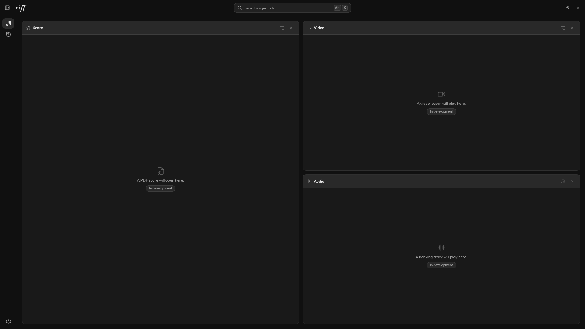

# Riff

A local-first practice workspace for musicians. A PDF score, a video lesson and an audio track side by side on one page, instead of three windows.

Linux only.



## Status

The foundation is complete: onboarding, theming, navigation, the keyboard palette and settings. **Practice and History are visual placeholders** — PDF, video and audio playback are not implemented yet.

## Privacy

Riff makes **no network connections at all**. No HTTP client is compiled into it, its Content Security Policy blocks outbound requests, and there are no accounts, no telemetry and no update check. Everything it stores is a plain file in your own directories:

| Path | Contents |
| --- | --- |
| `~/.config/riff/settings.json` | Your settings, with a JSON Schema beside it for editor completion |
| `~/.local/share/riff/` | Application data |
| `~/.local/state/riff/logs/` | Logs, rotated daily, seven kept |
| `~/.cache/riff/` | Regenerable cache |

Edit `settings.json` while Riff is running and it reloads live.

## Requirements

**webkit2gtk 4.1** (libsoup3) and **glibc 2.39 or newer** — Tauri v2's own floor, not a packaging choice, which is what rules out Ubuntu 22.04 and Debian 12.

## Install

Download the deb, rpm or AppImage from the [releases page](https://github.com/valasme/riff/releases):

```bash
sudo apt install ./riff_*_amd64.deb     # Debian, Ubuntu
sudo dnf install ./riff-*.x86_64.rpm    # Fedora
chmod +x riff_*.AppImage && ./riff_*.AppImage
```

Check a download against `sha256sums.txt`:

```bash
sha256sum -c sha256sums.txt --ignore-missing
```

Updates are manual, and reinstalling leaves your settings alone.

## Build from source

```bash
sudo apt install libwebkit2gtk-4.1-dev libgtk-3-dev librsvg2-dev patchelf
pnpm install
pnpm app          # development
pnpm app:build    # produces deb, rpm and AppImage
```

Node 26, Rust 1.98 and pnpm 11, pinned in `.nvmrc`, `rust-toolchain.toml` and `package.json`.

## Troubleshooting

Every session logs to its own folder under `~/.local/state/riff/logs/`, stamped with the version, distribution, desktop and session type. `latest` points at the current one.

```bash
riff doctor                 # check the installation
riff repair                 # fix what can be fixed
riff logs --tail 100        # recent output
riff logs export            # one redacted file for a bug report
```

`riff logs export` rewrites your home directory and username, so the result is safe to attach to an issue — and it is the most useful thing you can put in a bug report.

## Contributing

Riff is a personal project and **does not accept pull requests**. Bug reports and questions are genuinely welcome through [issues](https://github.com/valasme/riff/issues).

It is MIT licensed, so forking it and taking it wherever you like is explicitly fine.

## Licence

MIT — see [LICENSE](LICENSE). Third-party notices are in [THIRD-PARTY-LICENSES.md](THIRD-PARTY-LICENSES.md) and inside the application under Settings → About.
