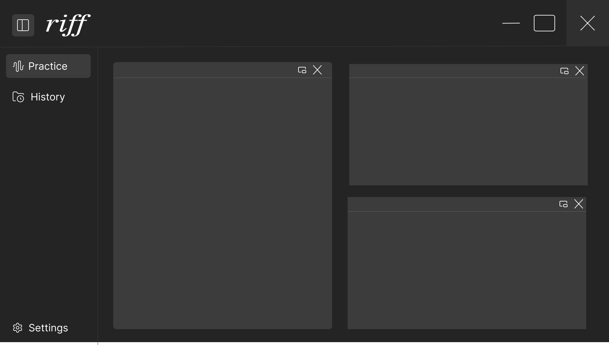

# Riff

A local-first practice workspace for musicians. Riff keeps a PDF score, a video lesson and an audio track side by side on one page, so you stop juggling three windows and start playing.

Linux only.



## Status

The application foundation is complete: onboarding, theming, navigation, the keyboard palette and fully working settings. **Practice and History are visual placeholders** — PDF, video and audio playback are not implemented yet.

## Privacy

Riff makes **no network connections at all**. There is no HTTP client compiled into it, and its Content Security Policy blocks outbound requests. No accounts, no telemetry, no update check. Everything it stores lives in your own directories as plain, editable files:

| Path | Contents |
| --- | --- |
| `~/.config/riff/settings.json` | Your settings, with a JSON Schema beside it for editor completion |
| `~/.local/share/riff/` | Application data |
| `~/.local/state/riff/logs/` | Logs, rotated daily, seven kept |
| `~/.cache/riff/` | Regenerable cache |

You can edit `settings.json` in a text editor while Riff is running; it reloads live.

## Requirements

- **webkit2gtk 4.1** (libsoup3) and **glibc 2.39 or newer**

This is Tauri v2's own floor, not a packaging choice, and it is what excludes Ubuntu 22.04 and Debian 12 regardless of how Riff is built.

## Install

Download the deb, rpm or AppImage from the [releases page](https://github.com/valasme/riff/releases), then:

```bash
sudo apt install ./riff_*_amd64.deb     # Debian, Ubuntu
sudo dnf install ./riff-*.x86_64.rpm    # Fedora
chmod +x riff_*.AppImage && ./riff_*.AppImage
```

Verify a download against `sha256sums.txt`:

```bash
sha256sum -c sha256sums.txt --ignore-missing
```

Updates are manual: download a newer release when you want one. Your settings are untouched by reinstalling.

## Build from source

```bash
sudo apt install libwebkit2gtk-4.1-dev libgtk-3-dev librsvg2-dev patchelf
pnpm install
pnpm app          # development
pnpm app:build    # produces deb, rpm and AppImage
```

Node 26, Rust 1.98 and pnpm 11 — all pinned in `.nvmrc`, `rust-toolchain.toml` and `package.json`.

## Contributing

Riff is a personal project and **does not accept pull requests**. Bug reports and questions are genuinely welcome through [issues](https://github.com/valasme/riff/issues).

It is MIT licensed, so forking it and taking it wherever you like is explicitly fine.

## Licence

MIT — see [LICENSE](LICENSE). Third-party notices are in [THIRD-PARTY-LICENSES.md](THIRD-PARTY-LICENSES.md) and inside the application under Settings → About.

## Troubleshooting

Riff logs every session to its own folder under `~/.local/state/riff/logs/`,
stamped with the version, distribution, desktop and session type it was
running under. `latest` always points at the current one.

```bash
riff doctor                 # check the installation
riff repair                 # fix what can be fixed
riff logs --tail 100        # recent output
riff logs export            # one redacted file for a bug report
```

`riff logs export` rewrites your home directory and username, so the result is
safe to attach to an issue. Attaching it is the single most useful thing you
can do in a bug report.
